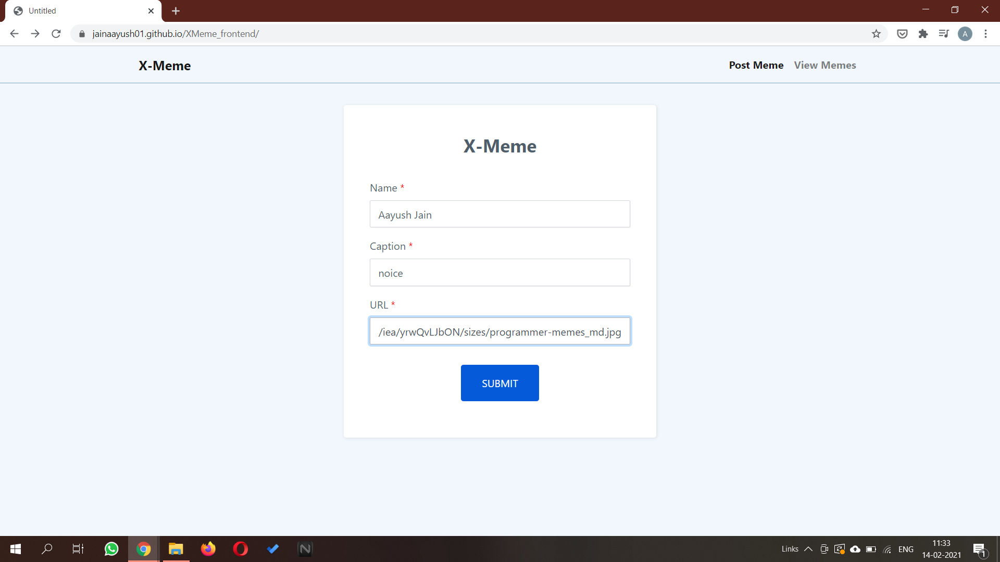
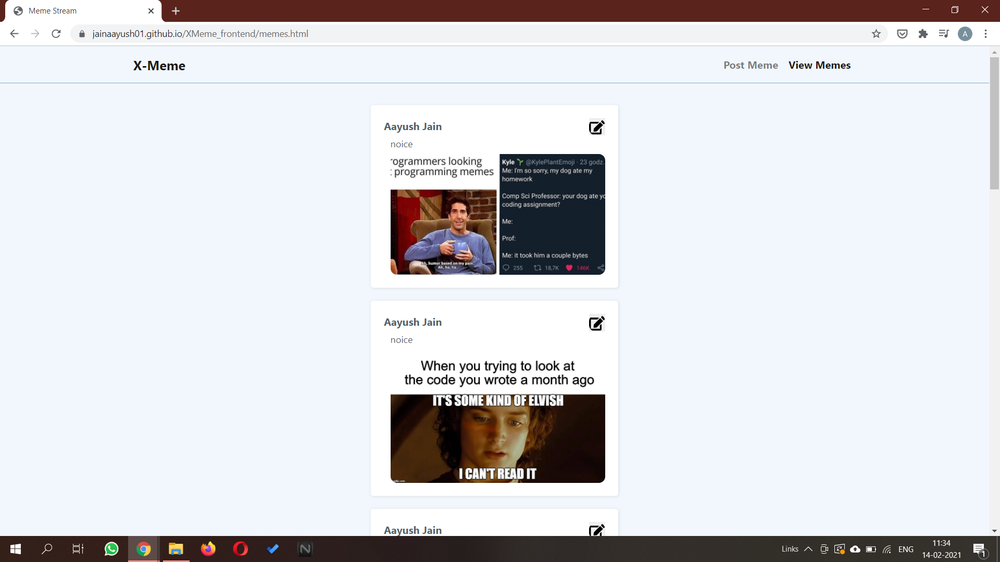
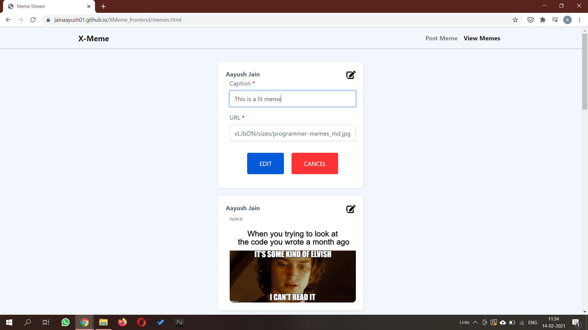
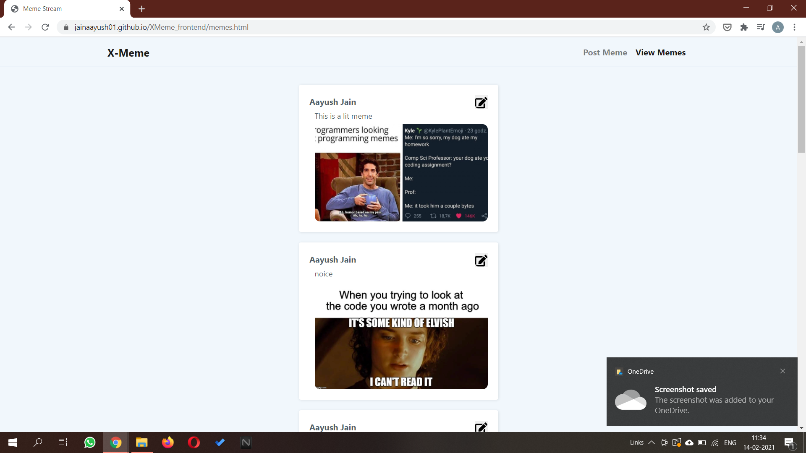
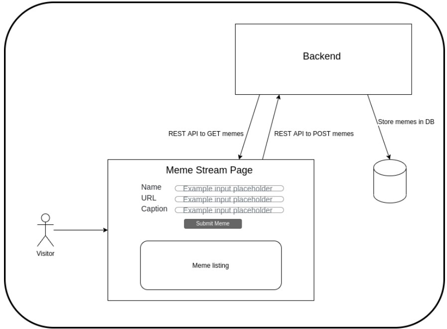

# X-Meme

#### NOTE: Backend Server and Swagger API docs run on the same port 8081.

#### Tech Stack Used:
* Frontend: HTML, CSS, JS, Bootstrap
* Backend: Node.js, Express.js, MongodDB.
* Dependencies: 
    * Express(Routing), 
    * Mongoose(Mongodb Modeling, Queries), 
    * CORS(Cross-origin resource sharing), 
    * JOI(Schema Validation), 
    * dotenv(env var),
    * body-parser(for body parsing),
    * SwaggerJsDoc(Generating swagger docs based on js doc),
    * Swagger-UI(UI for swagger docs)

## Deployment:  

[Frontend](https://x-meme.vercel.app/)

[Backend](https://mymemestream.herokuapp.com/)

[Swagger-API-documentation](https://mymemestream.herokuapp.com/api-docs/)

NOTE: Swaggger API Documentation is available on same port as backend server.

## Screenshots

 

 

 

 

## Architecture

Full Stack Web Application Architecture

## Features

1. Users can Post Memes by providing these inputs:
    * Name of Owner
    * Caption for Meme
    * Image URL

2. Users can see Memes posted by everyone

3. Users can edit Memes posted by anyone (Not allowed to edit owner name)

4. Fully Responsive Website with Mobile First Approach

5. Dockersied Solution is available

6. Swagger API Documentation.

7. Proper HTTP status codes

8. Validation at both Frontend and Backend and lets user know about it.

9. Only allows images URL that is valid url and also ends with supported image format by MIME.

## Setup

### Non Dockerised
Note: If you have node and mongodb installed on your device then head on to Step 2.

1. Run the install.sh bash script to install the nodejs and mongodb for backend.
    - `sh install.sh`

2. Run server_run.sh and you are good to go.(you can change env variable from here if you wish to run it in other ways,)
    - `sh server_run.sh`

### Dockerised 

1. Create the container Image
    - `docker build -t your_app_name .`

2. Run the container  
    - `docker run -d --net="host" xmeme_app`

Frontend can be used via index.html in frontend.

Swagger docs are available on same port as of backend.

## Further Todos:

1. Add Authentication.

2. User Profile.

3. Share Posts.

4. Download Memes.

5. Comments and Like Option.

6. Add different categories for different meme type(channels or something).
